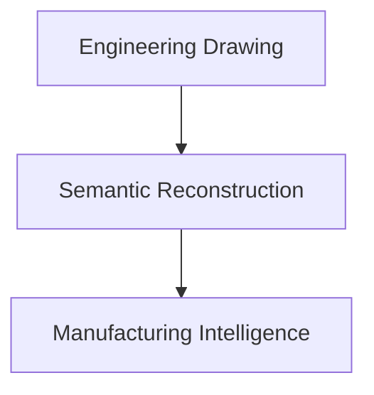
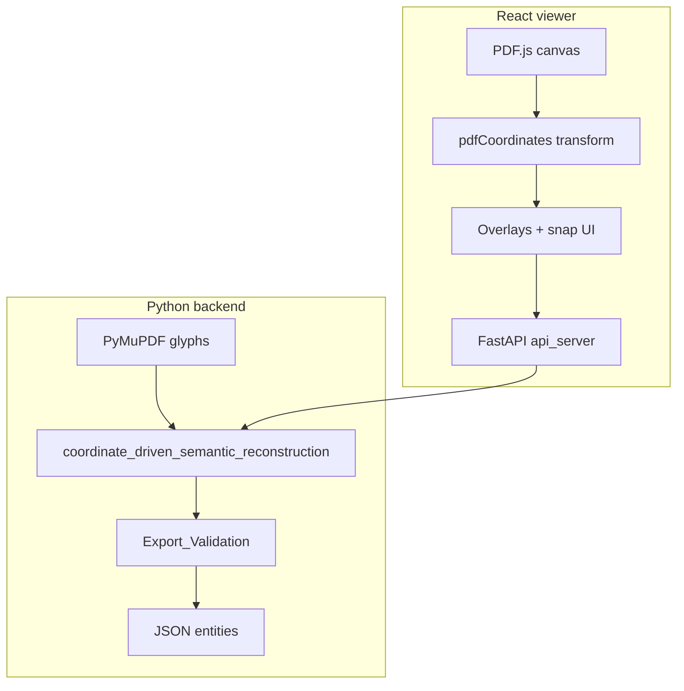

# Drawing AI — Engineering Dimension Semantic Extraction

Vector-driven reconstruction of engineering dimensions from PDF drawings. The system reads PDF text glyphs and vector geometry (via PyMuPDF), applies engineering grammar and plausibility rules, and exports structured dimension entities as JSON. An interactive web viewer lets you pick regions or snap to dimensions on the sheet instead of parsing the entire drawing blindly.

This is **not** a generic OCR pipeline. It is **engineering grammar stabilization**: axis chains, tolerance fusion, SRC pairs, THK binding, zone filtering, and confidence scoring.

## Value flow



**Meaning in practice**
- `Engineering Drawing`: raw PDF views, dimensions, symbols, title blocks, and drafting noise.
- `Semantic Reconstruction`: convert glyph geometry into validated dimension entities with grammar and plausibility.
- `Manufacturing Intelligence`: machine-usable outputs for inspection planning, QA automation, and downstream CAD/CAM/PLM workflows.

---

## What it does

| Capability | Description |
|------------|-------------|
| **Glyph extraction** | Per-character bboxes, fonts, and positions from PDF `rawdict` |
| **Axis-aware chains** | Horizontal / vertical reading flow (`left_to_right`, `bottom_to_top`) |
| **Grammar fusion** | `50.7 ±0.2`, implicit `17 X 28`, `(REF)` suffixes, inline tolerances |
| **Plausibility** | Rejects impossible tolerances, weak SRC pairs, metadata noise |
| **Export validation** | Title-block zones, orphan THK, vertical digit fusion, confidence scores |
| **Interactive UI** | Upload PDF, hover-snap, click-to-select, region extract, live JSON panel |

---

## Architecture

### Batch pipeline (full page)

```
PDF glyphs (PyMuPDF)
    → normalize coordinates
    → axis chains + directional reading
    → dimension grammar (tolerance, SRC, REF)
    → modifier attachment (± as child of nominal)
    → dedupe + THK fusion
    → geometry nearest-neighbor
    → export validation + confidence
    → vector_relationships.json (+ versioned snapshot)
```

### Interactive pipeline (user-guided locality)

```
Upload PDF
    → PDF.js render (browser)
    → hover snap / click or drag region
    → Fitz bbox → PDF.js viewport transform → screen overlay
    → region_semantic_extraction (same engine, clipped bbox)
    → JSON in side panel
```



---

## Project structure

| File / folder | Role |
|---------------|------|
| `backend/` | Python backend modules, FastAPI server, and uploaded docs |
| `backend/Text_geometry.py` | CLI entry — run full-page reconstruction on a PDF |
| `backend/coordinate_driven_semantic_reconstruction.py` | Core pipeline: chains, SRC, modifiers, `process_page_semantic()` |
| `backend/Dimension_Grammar.py` | Tokenize chains; fuse `NUMBER ± NUMBER`, implicit `X`, `(REF)` |
| `backend/Filter_Engineering.py` | Dimension / tolerance / nominal filters |
| `backend/Engineering_Plausibility.py` | Tolerance and SRC plausibility limits |
| `backend/Export_Validation.py` | Zone filter, metadata noise, vertical digit fusion, confidence |
| `backend/region_semantic_extraction.py` | Region clip + hover `snap_semantic_entity()` |
| `backend/pdf_geometry.py` | Shared bbox intersect helpers |
| `backend/api_server.py` | FastAPI: upload, file serve, extract, snap |
| `backend/uploads/` | Uploaded PDFs (gitignored) |
| `frontend/` | React + TypeScript + PDF.js interactive UI |
| `frontend/src/pdfCoordinates.ts` | PyMuPDF ↔ PDF.js viewport coordinate bridge |
| `outputs/` | `vector_relationships*.json` and other extraction outputs |
| `start_semantic_viewer.bat` | Start API + dev server (Windows) |
| `backend/requirements-api.txt` | FastAPI, uvicorn, PyMuPDF |

---

## Requirements

- **Python 3.11+** with virtual environment (`.venv`)
- **Node.js 18+** (for the viewer only)
- Windows paths below use `.venv\Scripts\`; on Linux/macOS use `source .venv/bin/activate` and `python3`

### Python dependencies

```bat
.venv\Scripts\activate.bat
pip install pymupdf
pip install -r backend/requirements-api.txt
```

---

## Quick start

### 1. Full-page extraction (CLI)

Edit the PDF path in `backend/Text_geometry.py` if needed, then:

```bat
cd F:\beta\Drawing_AI\beta\backend
..\.venv\Scripts\activate.bat
python Text_geometry.py
```

Writes `outputs/vector_relationships.json` and the next `outputs/vector_relationships_N.json` snapshot.

### 2. Interactive Semantic Extraction Viewer

**Option A — one command (Windows):**

```bat
start_semantic_viewer.bat
```

**Option B — manual:**

Terminal 1 — API (port 8000):

```bat
.venv\Scripts\activate.bat
pip install -r backend/requirements-api.txt
cd backend
..\.venv\Scripts\activate.bat
python -m uvicorn api_server:app --reload --port 8000
```

Terminal 2 — UI (port 5173):

```bat
cd frontend
npm install
npm run dev
```

Open **http://localhost:5173**

1. Upload an engineering PDF (e.g. `XFG00144.pdf`, `X6C22514.pdf`).
2. **Hover** near a dimension — blue snap highlight + tooltip.
3. **Click** to select and export JSON for that entity.
4. Or **drag** a rough box for region extraction (smart local parse).
5. Enable **Debug bboxes** to verify red alignment boxes on the drawing.

More detail: [frontend/README.md](frontend/README.md)

---

## API reference

| Method | Endpoint | Description |
|--------|----------|-------------|
| `GET` | `/api/health` | Health check |
| `POST` | `/api/documents/upload` | Upload PDF; returns `document_id`, page size |
| `GET` | `/api/documents/{id}/file` | Full PDF bytes for PDF.js |
| `GET` | `/api/documents/{id}/pages/{n}` | Page width/height |
| `POST` | `/api/documents/{id}/extract` | Body: `{ "page", "bbox": [x0,y0,x1,y1] }` — Fitz points |
| `POST` | `/api/documents/{id}/snap` | Body: `{ "page", "x", "y", "radius" }` — nearest entity |

Bboxes use **PyMuPDF coordinates** (origin top-left, Y increases downward). The viewer converts to/from PDF.js viewport space in `pdfCoordinates.ts`.

---

## Example entity (JSON)

```json
{
  "page": 1,
  "entity_type": "linear_dimension",
  "display_text": "50.7 ±0.2",
  "nominal": 50.7,
  "nominal_text": "50.7",
  "modifiers": [
    {
      "type": "tolerance",
      "value": "±0.2",
      "tolerance_type": "bilateral",
      "plus": 0.2,
      "minus": -0.2
    }
  ],
  "limits": { "min": 50.5, "max": 50.9 },
  "orientation": "horizontal",
  "dimension_axis": "horizontal",
  "reading_direction": "left_to_right",
  "grammar_rule": "NUMBER_OPERATOR_NUMBER",
  "confidence": 0.94,
  "text_bbox": [120.5, 340.2, 180.1, 352.0],
  "nearest_geometry_bbox": [125.0, 345.0, 175.0, 346.0],
  "distance": 2.4,
  "glyph_count": 8
}
```

Other `entity_type` values include `SRC_dimension`, `radius_dimension`, `thickness_dimension`, `reference_dimension`.

---

## Design principles

1. **Tolerance is a modifier**, not a standalone exported dimension.
2. **Direction is locked** per chain (no mirrored `17 X 28` / `28 X 17` duplicates).
3. **SRC and THK** use local anchor radius (~2 mm) — not global proximity.
4. **Unresolved fragments** (`unresolved_vertical_fragment`, single-digit orphans) are filtered before export on full-page runs.
5. **Human-assisted locality** in the viewer avoids title block, watermark, and cross-view noise.
6. **Never map PyMuPDF bboxes directly to CSS** — always go through `viewport.convertToViewportRectangle()` with the Fitz ↔ PDF Y-flip in `pdfCoordinates.ts`.

---

## Coordinate systems (important)

| Space | Origin | Y axis | Used by |
|-------|--------|--------|---------|
| PyMuPDF / Fitz | Top-left | Down | Backend `text_bbox`, API `bbox` |
| PDF.js PDF user | Bottom-left | Up | `convertToPdfPoint` / `convertToViewportRectangle` input |
| Browser canvas | Top-left | Down | Overlays, mouse events |

The viewer module `pdfCoordinates.ts` performs the Fitz ↔ PDF.js bridge and reapplies transforms on zoom so highlights stay aligned.

---

## Current limitations

- Parenthesis / REF recovery across **split axis chains** is still partial (e.g. `78.7(REF)` split across chains).
- Full-page mode still benefits from **title-block heuristics**; interactive mode relies on user region instead.
- OCR fallback (e.g. PaddleOCR) is **not** integrated — vector text only.
- Single-page focus in the viewer UI (multi-page supported via page control).

---

## Development status

| Area | Status |
|------|--------|
| Vector glyph extraction | Stable |
| Tolerance / SRC / THK grammar | Stable |
| Export validation & noise reduction | Stable |
| Interactive viewer + API | Stable |
| Hover snap + click select | Stable |
| Coordinate overlay alignment | Fixed via `pdfCoordinates.ts` |
| CAD-style semantic layer (all entities pre-indexed) | Planned |

---

## License

Add your project license here if applicable.

## Contributing

Run the viewer build before UI changes:

```bat
cd viewer
npm run build
```

Python smoke test for region snap:

```bat
python -c "from region_semantic_extraction import snap_semantic_entity; print(snap_semantic_entity('X6C22514.pdf',1,180,180))"
```
